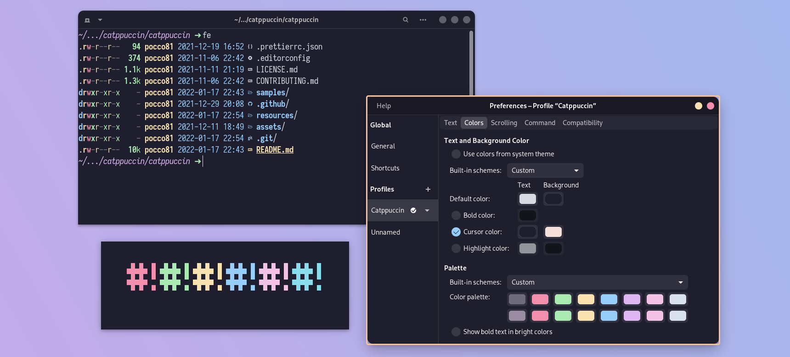

<h3 align="center">
	 
	
	Catppuccin for <a href="https://wiki.gnome.org/Apps/Terminal">Terminal</a>
	
</h3>

    
    
    

  

## Usage

1. Make sure `dconf` (sometimes called `dconf-cli` or `dconf-editor`) is installed on your system
2. `git clone https://github.com/catppuccin/gnome-terminal`
3. `cd gnome-terminal/` 
4. `./install.sh "Terminal profile name"` (you can create a profile by opening the Gnome Terminal >> ... >> Preferences >> Click on the `+` symbol)

> Note: the script can be executed without any argumnets: it will list your profiles, if you have any, or create a profile named "Default" and apply the theme to it

## 💝 Thanks to

- [Broccoli](https://github.com/broccoli5)

&nbsp;

Copyright &copy; 2021-present <a href="https://github.com/catppuccin" target="_blank">Catppuccin Org</a>

