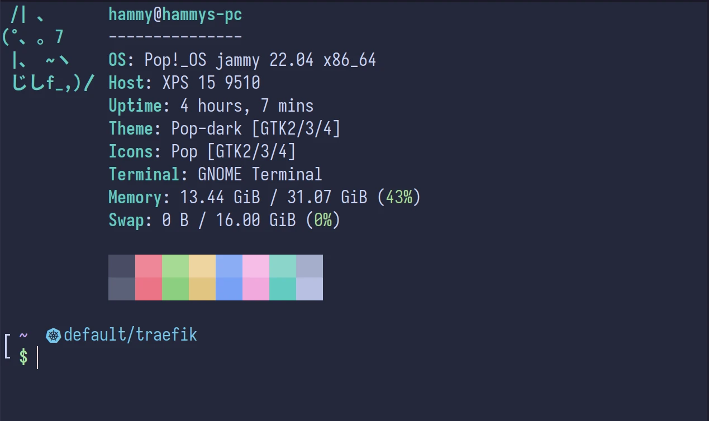

<h3 align="center">
  <br/>
  
  Catppuccin for <a href="https://wiki.gnome.org/Apps/Terminal">Gnome Terminal</a>
  
</h3>

<p align="center">
  <a href="https://github.com/catppuccin/gnome-terminal/stargazers"></a>
  <a href="https://github.com/catppuccin/gnome-terminal/issues"></a>
  <a href="https://github.com/catppuccin/gnome-terminal/contributors"></a>
</p>

<p align="center">
  
</p>

## Previews

<details>
<summary>🌻 Latte</summary>

</details>
<details>
<summary>🪴 Frappé</summary>

</details>
<details>
<summary>🌺 Macchiato</summary>

</details>
<details>
<summary>🌿 Mocha</summary>

</details>

## Usage

### Requirements

- **gsettings**
- **python3**

### Install

1. Execute the [install.py](./install.py) script, for example via `curl`:

   ```bash
   curl -L https://raw.githubusercontent.com/catppuccin/gnome-terminal/v1.0.0/install.py | python3 -
   ```

2. In Gnome Terminal, open `Edit -> Preferences`, and enable the profile for the theme you want.

### Uninstall

Execute the [uninstall.py](./uninstall.py) script, for example via `curl`:

```bash
curl -L https://raw.githubusercontent.com/catppuccin/gnome-terminal/v1.0.0/uninstall.py | python3 -
```

## 💝 Thanks to

- [winston](https://github.com/nekowinston)

&nbsp;

<p align="center"></p>
<p align="center">Copyright &copy; 2021-present <a href="https://github.com/catppuccin" target="_blank">Catppuccin Org</a>
<p align="center"><a href="https://github.com/catppuccin/catppuccin/blob/main/LICENSE"></a></p>
